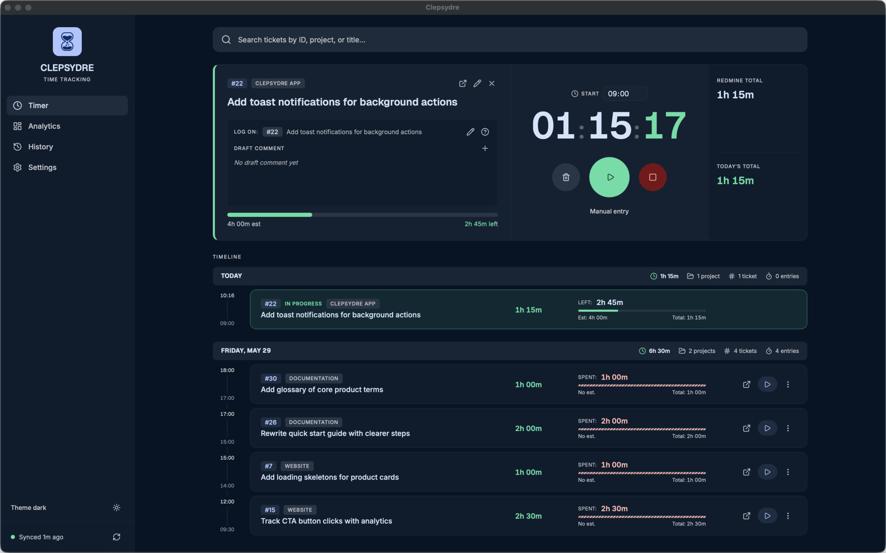

# Clepsydre

<p align="center">
  Redmine time tracking, without friction.<br/>
  A desktop app built for teams who want accurate logs, faster input, and better visibility.
</p>

<p align="center">
  <a href="https://jeremyrambaud.github.io/clepsydre/">Website</a>
  ·
  <a href="https://jeremyrambaud.github.io/clepsydre/docs/">Documentation</a>
  ·
  <a href="https://jeremyrambaud.github.io/clepsydre/docs/download/">Download latest version</a>
</p>

---



## Why Clepsydre

Clepsydre helps you track time in Redmine with precision and consistency, while keeping your daily workflow simple.

- Log and edit entries from one desktop interface.
- Start from a ticket, switch context quickly, and keep accurate timelines.
- Use activity dashboards (day, week, month) to spot missing or overloaded days.
- Keep credentials secure with OS keychain storage.
- Connect browser extensions (Chrome and Firefox) to start tracking from Redmine tickets.

## Get Started

For a complete setup guide, feature documentation, and latest downloads:

- Website: [jeremyrambaud.github.io/clepsydre](https://jeremyrambaud.github.io/clepsydre/)
- Documentation: [jeremyrambaud.github.io/clepsydre/docs](https://jeremyrambaud.github.io/clepsydre/docs/)
- Download: [jeremyrambaud.github.io/clepsydre/docs/download](https://jeremyrambaud.github.io/clepsydre/docs/download/)

## For Contributors

If you are working on the app locally:

```bash
bun install
bun run tauri dev
```

Build a production package:

```bash
bun run tauri build
```
